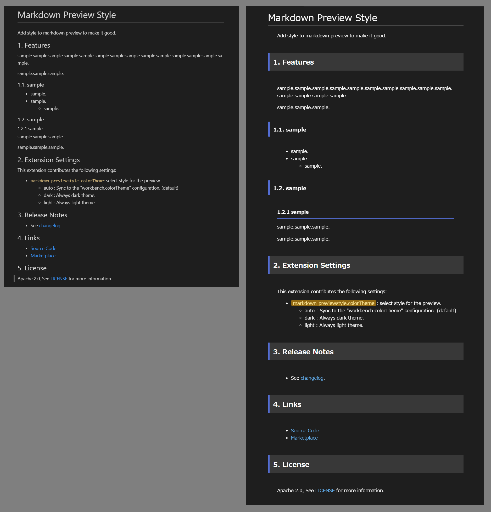

# Markdown Preview Style

Add style to markdown preview to make it good.

## 1. Features

- Left : markdown preview without this extension
- Right : markdown preview with this extension

## 2. Extension Settings

This extension contributes the following settings:

- `markdown-previewstyle.colorTheme`: select style for the preview.
    - auto : Sync to the "workbench.colorTheme" configuration. (default)
    - dark : Always dark theme.
    - light : Always light theme.

## 3. Release Notes

- See [changelog](CHANGELOG.md).

## 4. Links

- [Source Code](https://github.com/takumisoft68/vscode-markdown-previewstyle)
- [Marketplace](https://marketplace.visualstudio.com/items?itemName=TakumiI.markdown-previewstyle)

## 5. License

Apache 2.0, See [LICENSE](LICENSE) for more information.
